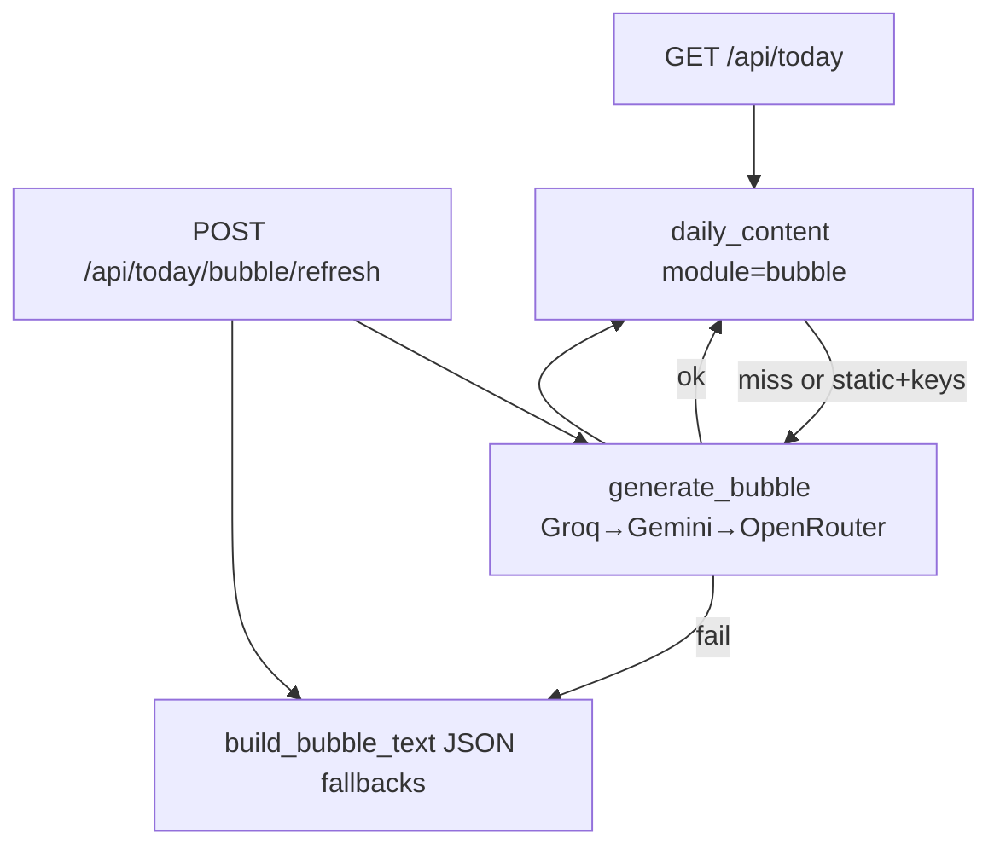

# Agent handoff — Fahéj (Animated Love App)

**Read this file first** in a new session to save tokens. Full user-facing docs: [README.md](README.md). LLM setup: [docs/LLM_SETUP.md](docs/LLM_SETUP.md). Original plan: `c:\Users\egera\.cursor\plans\hedgehog_love_app_65a90fb7.plan.md`.

---

## What this is

A **gift web app** for **Edina** featuring **Fahéj** (custom SVG hedgehog), Hungarian speech bubbles, weather, special dates, and a photo gallery. Built as a personal present; eventual deploy to Render (public URL + password).

**Owner constraints:** Python-first backend, React/TS frontend, local dev now, scalable later. User sets `APP_PASSWORD` in `.env` (never commit).

---

## Current status: Core MVP ✅ · Phase 1b ✅ · interactive bubbles ✅

| Done | Not done yet |
|------|----------------|
| FastAPI + SQLite + session auth | News RSS + summaries |
| `GET /api/today` (weather, mood, daily bubble, optional poem/book/movie) | `CloudMediaStore` implementation |
| **`POST /api/today/bubble/refresh`** — new bubble on each Fahéj tap | Render deploy + Postgres migration |
| LLM router (Groq → Gemini → OpenRouter) + static fallback | PWA, admin/guest split UI |
| `daily_content` + `llm_usage` cache; static cache bypass when LLM keys set | Real MP3 hedgehog sounds (optional) |
| `POST /internal/prefetch` + APScheduler 06:00 Budapest | |
| Content corpora + `GET /api/content/{module}` | |
| Mood engine + special dates | |
| `MediaStore` (local) + photo API | |
| React UI: Fahéj tap → POST refresh, loading state on bubble | |
| Open-Meteo weather (Szeged primary) | |
| `tzdata` for `Europe/Budapest` on Windows | |

**Local dev:** **Both** backend (uvicorn :8000) and frontend (`npm run dev` :5173) must run.

---

## Bubble text pipeline (important)



| Request | Behavior |
|---------|----------|
| **Page load** | `GET /api/today` — uses **daily cache** if present (`source: llm` or `static`) |
| **Fahéj tap** | `POST /api/today/bubble/refresh` — **always** regenerates (skips cache read); updates cache with latest |
| **No LLM keys** | Static Hungarian from `data/fallbacks/messages_hu.json` |
| **LLM keys + failed call** | Static text returned but **not** cached (retry on next tap) |
| **Cached `static` + LLM keys** | Normal `GET` bypasses stale static and retries LLM |

Interactive refresh sends **previous bubble** + random **variation_id** to Groq (temperature 1.0) so taps do not repeat the same line.

**Do not use `GET /api/today?refresh_bubble=1` for taps** — removed from frontend; GET can be browser-cached. Tap must use POST.

---

## Personalization (do not change without asking)

| Item | Value |
|------|--------|
| Recipient | Edina, birthday `11-14` |
| Hedgehog | Fahéj — playful, humorous, **Hungarian** bubbles |
| Weather city | **Szeged** (`weather_primary` in profile) |
| Also | Budapest listed in `places` |
| TZ | `Europe/Budapest` |
| Wedding anniversary | `11-12` |
| Engagement anniversary | `08-19` |
| Visual | Slightly illustrated SVG, warm pastels |
| Interests (for LLM / content) | LOTR, Harry Potter, Elden Ring, comedy films, TLC-style series |
| Photos | Both user and Edina upload (shared password); scale to hundreds |

**Mood priority:** `birthday` > special anniversaries > `weather_mood` > `idle`.

Config: [`config/profile.yaml`](config/profile.yaml) (gitignored; template: [`config/profile.example.yaml`](config/profile.example.yaml)).

---

## Repo layout

```
Animated Love App/
  agent_handoff.md
  README.md
  docs/LLM_SETUP.md
  .env / .env.example          ← APP_PASSWORD, SESSION_SECRET, LLM keys
  .env.llm.local.example       ← copy to .env.llm.local (gitignored)
  config/profile.yaml
  data/
    app.db
    fallbacks/messages_hu.json
    content/                   ← poems_hu.json, books.json, movies.json
    media/
  backend/
    app/main.py
    app/config.py
    app/api/routes/            ← auth, today, media, health, content, internal
    app/services/
      bubble_service.py        ← cache / LLM / static; force_refresh
      llm/router.py
      mood.py, weather.py, fallbacks.py, content_*.py
    app/db/models.py           ← MediaItem, DailyContent, LlmUsage
  frontend/
    src/api/client.ts          ← fetchToday(), refreshBubble() POST
    src/App.tsx                ← onHedgehogTap → refreshBubble
    src/components/TodayView.tsx, SpeechBubble.tsx
    src/hedgehog/
  scripts/
    start-backend.ps1
    configure-llm.ps1
    apply_llm_keys.py
    clear-bubble-cache.ps1
    clear_bubble_cache.py
    verify-llm.ps1 / verify_llm.py
```

---

## Run locally

**Two terminals required.**

| Terminal | Command | URL |
|----------|---------|-----|
| 1 — API | `.\scripts\start-backend.ps1` | http://127.0.0.1:8000 |
| 2 — UI | `cd frontend` → `npm run dev` | http://localhost:5173 |

**After editing `.env` or pulling backend changes:** stop uvicorn (Ctrl+C) and restart — stale process is the #1 cause of “static bubbles” or old API behavior.

**Quick checks:**

```powershell
Invoke-RestMethod http://127.0.0.1:8000/health
```

```powershell
.\scripts\verify-llm.ps1
```

**Clear stuck daily bubble** (optional):

```powershell
.\scripts\clear-bubble-cache.ps1
```

**Port 8000 busy:**

```powershell
Get-NetTCPConnection -LocalPort 8000 -State Listen | Select-Object OwningProcess
Stop-Process -Id <OwningProcess> -Force
```

---

## API summary

| Method | Path | Auth | Purpose |
|--------|------|------|---------|
| GET | `/health` | No | Health check |
| POST | `/api/auth/login` | No | Body: `{password}` → session cookie |
| GET | `/api/auth/me` | No | `{authenticated: bool}` |
| POST | `/api/auth/logout` | Session | |
| GET | `/api/today` | Session | Full dashboard; **cached** daily bubble (`Cache-Control: no-store`) |
| **POST** | **`/api/today/bubble/refresh`** | Session | **New bubble** for Fahéj tap → `{bubble_text, mood, bubble_source}` |
| GET | `/api/content/{poem\|book\|movie}` | Session | Cached daily module (if enabled in profile) |
| GET | `/api/media?...` | Session | Paginated gallery |
| POST | `/api/media` | Session | Upload photo |
| GET | `/api/media/file/{filename}` | Session | Serve image |
| POST | `/internal/prefetch` | `X-Prefetch-Secret` | Warm bubble + enabled modules |

Production: `frontend/dist` mounted at `/` when folder exists (`main.py`).

---

## Enable LLMs (operator)

Keys are **not** in git. See [docs/LLM_SETUP.md](docs/LLM_SETUP.md).

1. Create keys (Groq, Gemini, OpenRouter) — at least one required.
2. `copy .env.llm.local.example .env.llm.local` → paste keys, or run `.\scripts\configure-llm.ps1`
3. `.\.venv\Scripts\python scripts\apply_llm_keys.py`
4. Restart backend
5. `.\scripts\clear-bubble-cache.ps1` if old static text stuck
6. `.\scripts\verify-llm.ps1` — expect `cache source: llm` after a fresh `/api/today`

Env vars: `GROQ_API_KEY`, `GEMINI_API_KEY`, `OPENROUTER_API_KEY`, optional `LLM_DAILY_CALL_LIMIT` (default 50), `PREFETCH_SECRET`, `ENABLE_SCHEDULER`.

---

## Phase 1b — done · next: deploy

1. ~~LLM router~~ — `backend/app/services/llm/router.py`
2. ~~Prefetch~~ — `POST /internal/prefetch` + APScheduler
3. ~~Content modules~~ — `data/content/*.json`; `modules_enabled`: `poem` / `book` / `movie` (legacy `poems`/`books`/`movies` ok)
4. ~~Interactive tap~~ — `POST /api/today/bubble/refresh`
5. **Deploy prep** — Postgres, `CloudMediaStore`, HTTPS cookies on Render
6. **News** — RSS + LLM digest (Phase 2)

---

## Known pitfalls (already hit)

1. **`ZoneInfoNotFoundError`** on Windows → `tzdata` in `requirements.txt`.
2. **Stale uvicorn** — code/`.env` changes ignored until restart on :8000; causes static bubbles, wrong password, or missing POST route.
3. **Bubble stuck on one message** — old `static` row in `daily_content`; run `clear-bubble-cache.ps1` or tap Fahéj (POST refresh) after backend restart.
4. **Tap must be POST** — Network tab should show `POST /api/today/bubble/refresh`, not only `GET /api/today`.
5. **`Hibás jelszó`** — stale uvicorn with default `changeme`; restart backend.
6. **Frontend-only** — Vite proxies `/api` to :8000; API must be up.
7. **Duplicate backend on :8000** — stop old PID before second `start-backend.ps1`.
8. **Do not commit** `.env`, `.env.llm.local`, `config/profile.yaml`, `data/media/*`.
9. **Ephemeral disk on Render** — plan for Postgres + object storage before deploy.

---

## Design decisions (locked)

- **No stock Lottie** — custom SVG + CSS/WAAPI moods.
- **AI cost model** — daily cache for page load; tap refresh counts against `LLM_DAILY_CALL_LIMIT`.
- **Apple/iCloud location** — deferred.
- **Poem/book/movie cards** — corpus-based (not LLM); bubbles only use LLM today.

---

## Files to touch for common tasks

| Task | Files |
|------|--------|
| Hungarian static copy | `data/fallbacks/messages_hu.json`, `backend/app/services/fallbacks.py` |
| Bubble / tap / cache logic | `backend/app/services/bubble_service.py`, `backend/app/api/routes/today.py` |
| LLM providers / prompts | `backend/app/services/llm/router.py` |
| Tap → API wire-up | `frontend/src/App.tsx`, `frontend/src/api/client.ts` |
| Dates / name / city | `config/profile.yaml` |
| Hedgehog look/animation | `frontend/src/hedgehog/HedgehogCharacter.tsx`, `hedgehog.css` |
| Content modules | `data/content/*.json`, `modules_enabled` in profile |
| Auth / CORS | `backend/app/main.py`, `backend/app/api/routes/auth.py` |
| Photo storage | `backend/app/services/media_store.py` |

---

## Token-saving tips for the next agent

1. Read **this file** + [docs/LLM_SETUP.md](docs/LLM_SETUP.md) before broad searches.
2. Skip `.venv/`, `node_modules/`, `data/media/` binaries.
3. Test bubble tap with `POST /api/today/bubble/refresh` (httpx), not repeated GET.
4. If bubbles look static: restart backend → `clear-bubble-cache.ps1` → verify POST on tap.
5. Ask user before changing Edina’s profile facts or visual identity.

---

*Last updated: June 2026 — Phase 1b LLM, interactive POST bubble refresh, cache/fallback fixes.*
